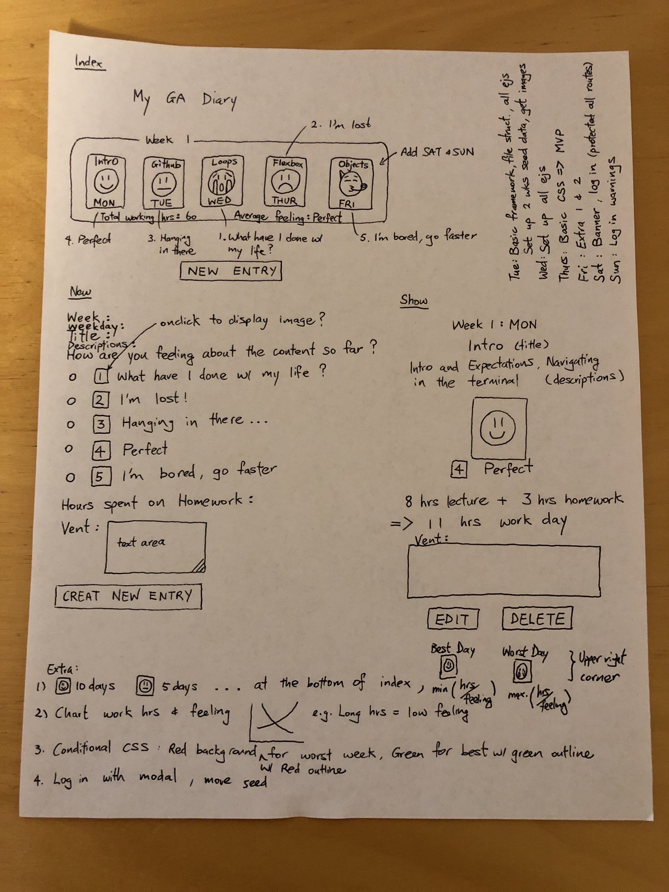

# My gaDiary
https://wlawgadiary.herokuapp.com/

* Create GA diary that is tied to the username
* Logs daily GA progress (e.g. class hrs, homework hrs, feeling etc)
* Logs are sorted by week and weekday on index page
* Sum weekly work hrs and calculates weighted average feeling
* Overview on index keep tracks of the number of days under each feeling category.  It also identifies the Best and Worst week in terms of weekly work hrs
* Charts daily work hours and feeling under Overview or by the week

## Resources Used

* MongoDB Atlas

* Heroku

* Apple emoji images   
https://emojipedia.org/apple/      

## Wire Framing


## Technology Used
* HTML
* CSS   
* Javascript
* jQuery  
* Google Fonts
* Chart.js
* Express
```javascript
"dependencies": {
  "bcrypt": "^3.0.6",
  "dotenv": "^8.2.0",
  "ejs": "^2.7.1",
  "express": "^4.17.1",
  "express-session": "^1.17.0",
  "method-override": "^3.0.0",
  "mongoose": "^5.7.8"
}
```

## Approach Taken
Here are the steps taken to populate the index page

### Find logs based on username and sort them by week then weekday
```javascript
router.get("/", isAuthenticated, (req, res) => {
  Log.find({username:req.session.username}, (error, allLogs) => {
    res.render("app/index.ejs", {logs: allLogs, username:req.session.username});
  }).sort({week:1}).sort({weekday:1})
})
```
### Overview fieldset
A for loop to generate  
```javascript
// Calculates the Best week and Worst week
weeklyHrsArray.push(weeklyHrs)

// Calculates the number of days in each Feeling category
let feelingCry = logs.filter(obj => {
      return obj.feeling === 1;
    }).length;
```

### Week fieldset
A for loop to populate logs by week  
```javascript
// Filter logs into weeklyLogs
for (var k = 1; k <= highestWeek; k++) {
  let weeklyLogs = logs.filter(obj => {
    return obj.week === k;
  });

// Calculates the weekly total working hours
weeklyHrs += obj["classHrs"]+obj["homeworkHrs"];

// Calculates weighted average feeling
avgFeeling += obj["feeling"]*(obj["classHrs"]+obj["homeworkHrs"]);

avgFeeling = Math.round(avgFeeling/weeklyHrs);
```

### Limitations of the App
* Does not identify duplicate weekdays
* Identify the first Best or Worst week due to the indexof function used
* More fluff!?!
